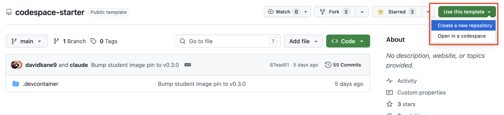
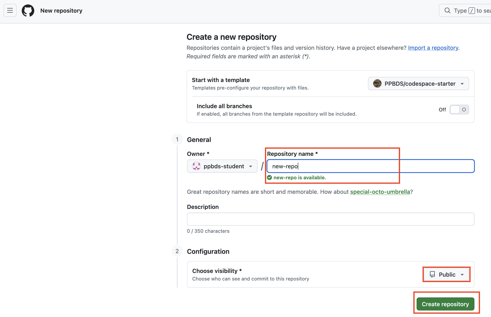
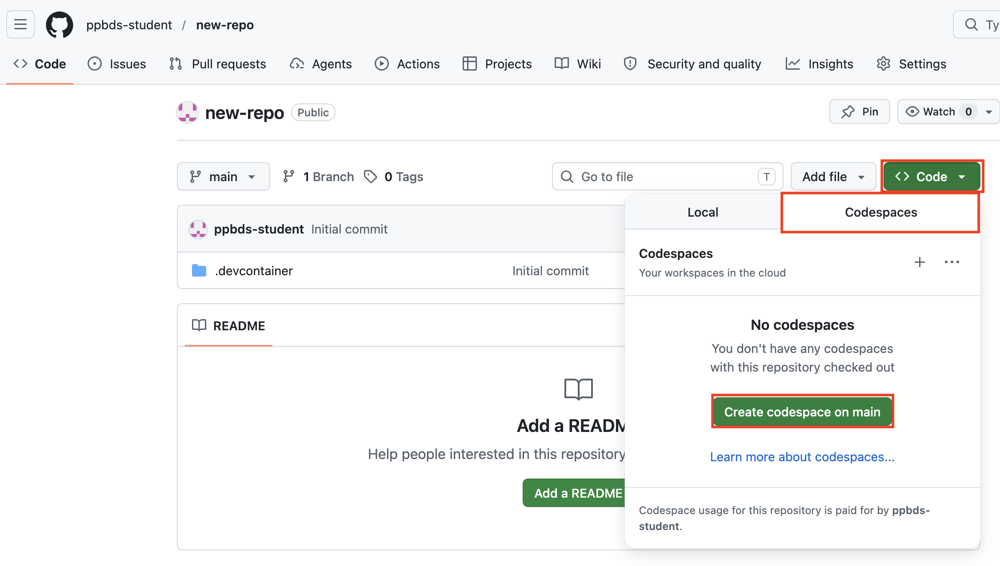
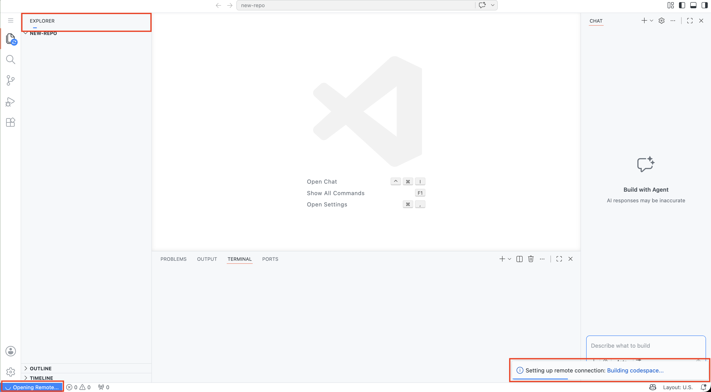
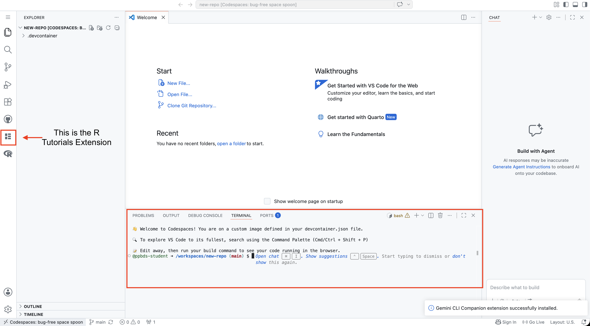

# PPBDS Codespace Starter

This repository is the starting point for doing data science work in the [PPBDS](https://ppbds.github.io/primer/) course.

When you take this course, you will write and run code using a **Codespace** — a coding environment that lives in the cloud and opens right in your web browser. You do not need to install anything on your computer. Everything you need (R, Quarto, and all the required tools) comes pre-installed and ready to go.

This repository is set up as a **template**, which means you will make your own personal copy of it for each tutorial you work on. The guide below walks you through that process step by step.

---

# Setting Up Your Codespace

This guide walks you through creating your own copy of this repository and opening a Codespace — a cloud-based coding environment that runs directly in your browser. No software installation required.

---

## Prerequisites

You will need a free [GitHub account](https://github.com/join). If you don't have one yet, create one before continuing.

---

## Step 1 — Create your own repository from the template

1. Click the green **Use this template** button near the top-right of this page, then select **Create a new repository**.

   

2. On the next screen:
   - Give your repository a name that matches the tutorial you are currently working on (e.g., `01-code`, `r4ds-1`, etc.). Your instructor will tell you the exact name to use.
   - Set the visibility to **Public**.
   - Leave everything else at the default.

   

3. Click **Create repository**. GitHub will create a personal copy of the template under your account.

---

## Step 2 — Open a Codespace

1. From your newly created repository, click the green **Code** button.

   

2. In the dropdown that appears, click the **Codespaces** tab. Then click **Create codespace on main**.

3. A new browser tab will open and GitHub will begin building your Codespace. This first-time setup takes a few minutes — you will three loading bars while it works:

   

---

## Step 3 — Confirm your Codespace is ready

When setup is complete, the VS Code editor will have the R Tutorials extension in the Activity Bar and the terminal at the bottom of the screen will display a command prompt:

You are now in your Codespace. All course tools — R, Quarto, and the required VS Code extensions — are pre-installed and ready to use.